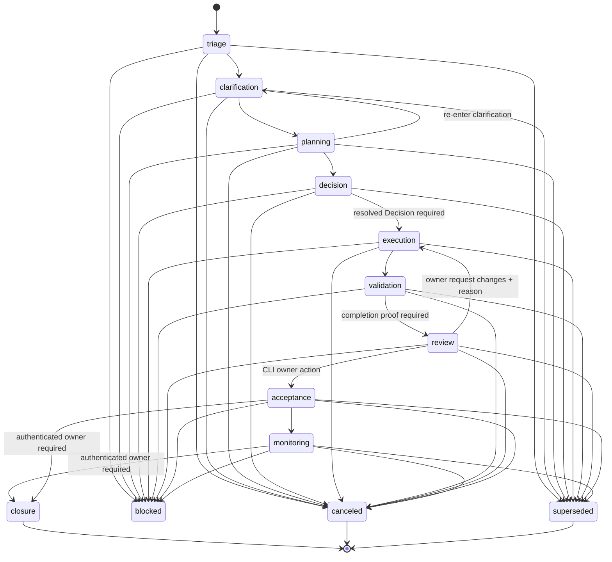

# Canon runbook

Canon is Brutus's durable portfolio, evidence, and review layer. It is not a
replacement for Linear: Linear remains the system of record for delivery
tickets. Canon preserves the work signal, its evidence and run history, and
the owner decisions needed to turn work into an accountable outcome.

This implementation follows the [REV-510 Canon specification][rev-510] and
its [v1 state-machine document][rev-510-spec]. The code is intentionally
fail-closed at its completion gates: worker narration, a free-text actor name,
or a bare approval does not finalize Canon work.

[rev-510]: https://linear.app/clearspeed/issue/REV-510
[rev-510-spec]: https://linear.app/clearspeed/document/brutus-canonical-work-objects-and-state-machine-v1-spec-07601bfa36fe

## The eight Canon objects

All objects have UUID `id` values by default. Timestamps default to UTC when
the object is created.

| Object | Purpose | Fields and allowed values |
| --- | --- | --- |
| **InboxItem** | An immutable, unreviewed signal that may become work. `raw_capture` is verbatim text or attachment references; annotate around it rather than editing it. | `id`, `raw_capture`, `source`, `received_at`, `status`. Inbox status is `uncategorized`, `reviewed`, `promoted`, or `discarded`. |
| **Project** | A named, owned body of related work. | `id`, `name`, `objective`, `owner`, `created_at`, `status`, `work_item_ids`. Project status is `active`, `paused`, or `archived`. |
| **WorkItem** | The individual commitment moving through the state machine. It indexes its supporting objects rather than embedding them. | `id`, `title`, `description`, `project_id` (optional), `origin` (`direct` or an inbox-item ID), `type`, `priority`, `assignee` (optional), `state`, `state_history`, `evidence_refs`, `approval_refs`, `decision_refs`. Work-item type is `task`, `decision`, `investigation`, `policy`, or `communication`. |
| **Decision** | The resolved choice needed to proceed or explain a result. | `id`, `question`, `options_considered`, `chosen_option`, `rationale`, `decided_by`, `decided_at`, `linked_work_item_ids`, `evidence_refs`. |
| **Evidence** | A captured, linkable artifact. It is not proof until marked verified by an authorized verifier. | `id`, `type`, `captured_at`, `captured_by`, `captured_by_kind`, `linked_object_id`, `content_ref`, `verified`, `verified_by` (optional). Evidence type is `log`, `screenshot`, `diff`, `run_output`, `doc_link`, or `external_url`; `captured_by_kind` distinguishes `human` and `worker`. |
| **Run** | One worker/agent attempt against one Work Item. A worker can report an attempt, failure, block, or readiness for review; it cannot record acceptance or closure. | `id`, `actor`, `work_item_id`, `started_at`, `ended_at` (optional), `status`, `prove_verdict` (optional), `target`, `scope`, `evidence_refs`. Run status is `implementation_attempted`, `blocked`, `failed`, or `ready_for_review`. The optional Prove verdict is `PASS`, `FAIL`, or `UNSURE`. |
| **Approval** | A narrowly scoped consent record, not blanket authorization or identity proof. | `id`, `work_item_id` (optional), `run_id` (optional), `requested_by`, `approved_by` (optional), `scope`, `granted_at` (optional), `expires_at` (optional), `status`. Approval status is `pending`, `granted`, `denied`, or `revoked`. A granted approval needs `approved_by`, and that actor must be an authenticated owner. |
| **Watch** | A request to observe a work item, project, or external resource and notify a channel when its condition occurs. | `id`, `target`, `watcher`, `trigger_condition`, `notify_channel`, `active`. |

`StateHistoryEntry` is the audit record nested in a Work Item. Each entry has
`state`, `actor`, `time`, `reason`, and an optional `evidence_ref`.

## State machine

The happy path is a strict forward progression:



`closure`, `canceled`, and `superseded` are terminal: no later transition is
allowed. The side states are reachable from every non-terminal happy-path
state:

* **blocked** requires a non-empty blocking reason.
* **canceled** requires a non-empty reason.
* **superseded** requires `superseded_by`; the transition records that link as
  the reason if the caller did not provide one.

For happy-path moves, Canon permits only the next state. There are two explicit
exceptions: `planning -> clarification` is a re-entry loop, and
`review -> execution` is an owner request for changes and requires a reason.
Leaving `decision` for `execution` requires a supplied Decision with
`decided_by` and `decided_at`. `validation -> review` is the completion-proof
gate described next.

### Completion proof at the validation gate

`completion_proof_ok()` is evaluated when a Work Item moves from `validation`
to `review`. It is not a generic check on every state. The transition receives
the candidate Evidence, Decision, Approval, and `has_owner_review_comment`
flag from its caller, and evaluates the following exact conditions:

| Work Item type | `completion_proof_ok()` passes when | Important implementation detail |
| --- | --- | --- |
| `task` | There is verified diff/PR/commit evidence **and** verified `run_output` evidence. A diff candidate has type `diff`, or its `content_ref` contains `pull` or `commit`. | Both required categories must themselves be verified; unrelated verified evidence cannot substitute. |
| `investigation` | A Decision is supplied with non-empty `rationale` and `decided_by`, **and** either the Decision has at least one `evidence_refs` entry or any supplied Evidence is verified. | The function checks that the Decision has an evidence reference, but does not resolve that reference or verify it when taking that branch. |
| `policy` | There is verified Evidence of type `doc_link` **and** `has_owner_review_comment=True`. | The owner-review comment is a caller-provided boolean; the function does not persist or inspect the comment itself. |
| `communication` | A supplied Approval has status `granted` and there is verified post-action evidence. If `granted_at` is set, post-action Evidence must have `captured_at >= granted_at`; otherwise any verified supplied Evidence qualifies. | The function does not itself match the Approval's scope, work item, or run; callers must supply the appropriate record. |
| `decision` | At least one supplied Evidence item is verified. | This type uses the default branch because only the four types above have specialized checks. |
| Any future/unrecognized type | At least one supplied Evidence item is verified. | This is the same default branch. |

Passing this table allows entry to `review`; it does **not** accept or close the
Work Item. Conversely, `acceptance` itself does not rerun the proof table. The
normal path reaches it only after the validation gate and an owner review.

## Owner gate: acceptance and closure

`acceptance` and `closure` are `OWNER_GATED_STATES`. Canon does not treat a
matching string in an `actor` field as authentication. It requires an
`AuthenticatedPrincipal` issued by the configured `IdentityRegistry`, whose
identity matches the claimed actor and whose kind is `human_owner`.

The registry has three principal kinds:

* `human_owner` — the one configured owner; required for owner-gated state
  transitions and for a recorded approval's `approved_by`.
* `worker` — an allowlisted worker/agent; it cannot satisfy the owner gate.
* `automated_verifier` — an allowlisted verifier; it may verify Evidence but
  cannot satisfy the owner gate.

An Approval records consent for its exact scope. It does not authenticate a
worker or agent to finalize Canon state. Closure has the additional ordering
rule that the current state must be `acceptance` or `monitoring`.

The diagram shows the supported CLI path into acceptance: `review ->
acceptance`. At the lower-level `transition()` API, the owner-gate branch runs
before happy-path ordering, so a caller with a valid owner principal can enter
`acceptance` from any non-terminal state. Callers should preserve the intended
review path; the CLI enforces it by only performing owner actions from
`review`.

The local CLI obtains the configured owner's registry-issued principal rather
than accepting an `--actor` flag. Its `accept`, `reject`, and
`request-changes` actions only operate on Work Items already in `review`.
Reject and request-changes require a recorded reason; accept transitions to
`acceptance`, reject to terminal `canceled`, and request-changes back to
`execution`.

## Runs, Hands, and Prove

`CanonHandsDispatcher` creates a Run before handing work to a worker. It
captures worker artifacts as Evidence linked to that Run, then runs Prove once
at the persistence boundary and stores the result in `Run.prove_verdict`.
Worker-produced Evidence starts unverified; Prove PASS is not a substitute for
authorized Evidence verification or for owner acceptance.

The stored Prove result maps to Run status as follows:

| Prove verdict | Stored Run status |
| --- | --- |
| `PASS` | `ready_for_review` |
| `FAIL` | `failed` |
| `UNSURE` | `implementation_attempted` |

The dispatch-path helper `transition_run_to_review()` adds a second gate before
moving a Work Item from `validation` to `review`: the Run must belong to that
Work Item, be `ready_for_review`, and have a persisted `PASS` verdict. It then
loads that Run's Evidence only and evaluates the completion-proof table before
calling the canonical transition. The state machine independently repeats the
completion-proof check; however, its generic `transition()` function does not
by itself require a Run or Prove verdict. Use the dispatch-path helper when a
Hands Run is the basis for review.

## CLI workflow

Canon's local database is `state/canon.db` by default. Set
`BRUTUS_CANON_DB_PATH` or pass `--db /path/to/canon.db` to use another database.
The commands below use an explicit path so a collaborator can safely practice
without touching the default store.

### 1. Capture Slack signals into the inbox

```bash
brutus canon --db state/canon.db inbox capture-slack --limit 50
# Record a manual signal with its provenance; this never promotes the item.
brutus canon --db state/canon.db inbox capture \
  --raw-capture "Customer asked for renewal investigation" \
  --source "manual:customer-call:2026-08-23"
brutus canon --db state/canon.db inbox list --status uncategorized
brutus canon --db state/canon.db inbox show <inbox-item-id>
```

`capture-slack` polls Atlas6's configured Slack channels through its existing
peek endpoint. `capture` records a supplied verbatim signal and required
provenance. Both store immutable, unreviewed InboxItems and do not create a
Work Item or promote anything. Slack capture stores structured
conversation/sender/timestamp provenance in `source`; repeated polls
deduplicate by that source record.

### 2. Explicitly review and promote an InboxItem

```bash
brutus canon --db state/canon.db inbox promote <inbox-item-id> \
  --title "Investigate renewal discrepancy" \
  --description "Optional curated scope; defaults to the raw capture" \
  --type investigation \
  --priority 2
```

Promotion is an explicit configured-owner action. It marks the inbox item
`promoted`, creates the Work Item in `triage`, and sets `origin` to the Inbox
Item ID. An already promoted or discarded item cannot be promoted.

### 3. Inspect the work and its review packet

```bash
brutus canon --db state/canon.db list
brutus canon --db state/canon.db list --state review
brutus canon --db state/canon.db show <work-item-id>
```

`list` shows the work queue with type, priority, and age in its current state.
`show` prints the Work Item and the linked Evidence, Decisions, Approvals, and
Runs, including both direct references and reverse links discovered in Canon.

### 4. Record the owner review outcome

```bash
# From review to acceptance
brutus canon --db state/canon.db accept <work-item-id>

# From review to terminal canceled, with an auditable reason
brutus canon --db state/canon.db reject <work-item-id> \
  --reason "No longer needed"

# From review back to execution, with an auditable change request
brutus canon --db state/canon.db request-changes <work-item-id> \
  --reason "Add a verified regression test"
```

Before accepting a Run-backed Work Item, confirm that the relevant Run has
`prove_verdict: PASS`, `status: ready_for_review`, and the specific verified
evidence required by its type. The CLI owner action is the final accountable
decision; it does not turn worker claims into proof.

### 5. Move work through lifecycle states and record Decisions

Use `work transition` for normal non-owner-gated states. It delegates every
check to Canon's state machine, including reason requirements, side-state
rules, and the validation proof table. `accept` and `close` remain separate
commands because they use the configured owner's authenticated principal.

```bash
brutus canon --db state/canon.db work transition <work-item-id> --to clarification
brutus canon --db state/canon.db work transition <work-item-id> --to planning

brutus canon --db state/canon.db decision create \
  --question "Which implementation path?" \
  --option "manual" --option "cli" \
  --chosen-option "cli" \
  --rationale "The dogfood flow needs a repeatable supported path" \
  --decided-by justin.fowler@clearspeed.com
brutus canon --db state/canon.db decision link <decision-id> <work-item-id>

brutus canon --db state/canon.db work transition <work-item-id> --to decision
brutus canon --db state/canon.db work transition <work-item-id> --to execution \
  --decision-id <decision-id>
brutus canon --db state/canon.db work transition <work-item-id> --to validation
```

For a low-risk `task`, the audited lightweight `triage|planning -> execution`
path requires all three explicit flags:

```bash
brutus canon --db state/canon.db work transition <work-item-id> --to execution \
  --decision-not-required "Copy-only change" \
  --lightweight-scope "One help-text correction" \
  --low-risk
```

Use `--reason` for `blocked`, `canceled`, and review rework, and
`--superseded-by <work-item-id>` for `superseded`. Validation errors are
returned as CLI guidance rather than tracebacks.

### 6. Run, prove, verify, and enter review without Python glue

`run dispatch` is a documented CLI adapter around `CanonHandsDispatcher`. It
accepts a local structured Hands handoff, stores the Run and worker artifacts,
and writes the existing Prove verdict. Pass repeatable `--evidence key=value`
receipts such as `--evidence sha=abc123` and
`--evidence test_exit_code=0`; the adapter does not trust narration alone.
Use `run start` when only a started Run record is needed before dispatch.

```bash
brutus canon --db state/canon.db run start <work-item-id> \
  --actor atlas6-worker --target brutus --scope "Investigate failure"

brutus canon --db state/canon.db run dispatch <work-item-id> \
  --actor atlas6-worker --target brutus --scope "Implement fix" \
  --summary "No completion claim yet"
# prints the Run ID, status, and Prove PASS|FAIL|UNSURE verdict

brutus canon --db state/canon.db evidence attach <run-id> \
  --type diff --content-ref "commit abc123"
brutus canon --db state/canon.db evidence attach <run-id> \
  --type run_output --content-ref "pytest -q: 620 passed"
brutus canon --db state/canon.db evidence verify <evidence-id>
brutus canon --db state/canon.db run review <run-id>
```

`evidence verify` authenticates the configured owner by default; an
allowlisted automated verifier can be selected with `--verifier <identity>`.
`run review` is a thin adapter around `transition_run_to_review()`: it
requires the Run to belong to a validation Work Item, have `Prove PASS`, be
`ready_for_review`, and have the exact verified proof required by that work
type.

### 7. Close an accepted outcome

```bash
# The configured owner principal is used; closure is terminal.
brutus canon --db state/canon.db close <work-item-id> \
  --reason "Owner accepted the completion proof"
```

`close` only permits the accepted ordering: the Work Item must currently be in
`acceptance` or `monitoring`. It records the supplied reason (or a clear
configured-owner default) and prints the terminal closure state.

## Storage, migrations, and recovery

`CanonStore` persists one JSON model payload per object row in SQLite. A
file-backed store enables WAL mode and a five-second busy timeout: readers can
continue while a writer commits, but SQLite still allows one writer at a time.

On open, the store runs ordered `NNNN_description.sql` files from
`brutus/canon/migrations/` in an immediate transaction and records each
successfully applied version in `schema_migrations`. Add a new numbered
migration for a persisted-schema change; do not edit a migration that might
already be applied. The optional `Run.prove_verdict` required no table DDL
because object payloads are JSON and the model field is backward compatible.

Back up with `CanonStore.backup(destination)`, which uses SQLite's online
backup API, rather than copying a live `.sqlite`, `-wal`, and `-shm` set.
Keep backups separate from the live database and periodically test
`CanonStore.restore(source, destination)`, which opens the restored database
and applies any newer migrations.
